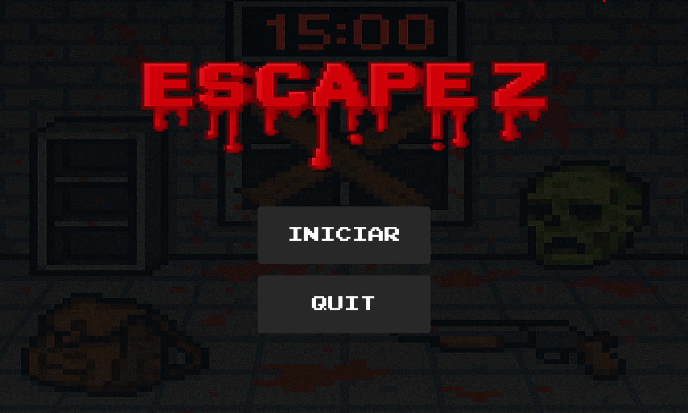
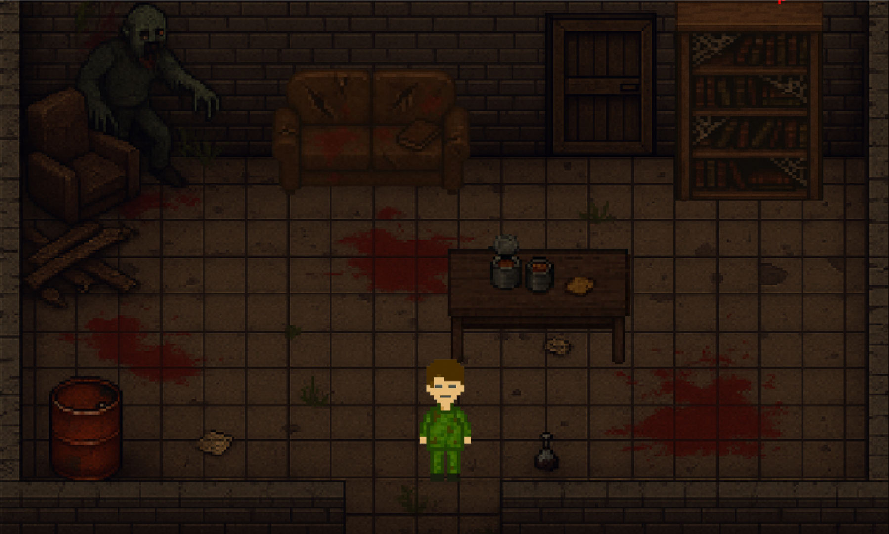
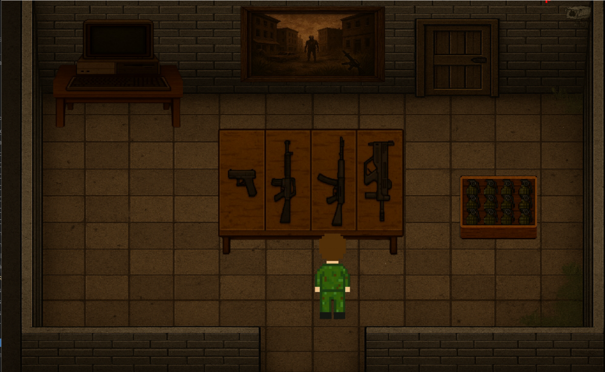
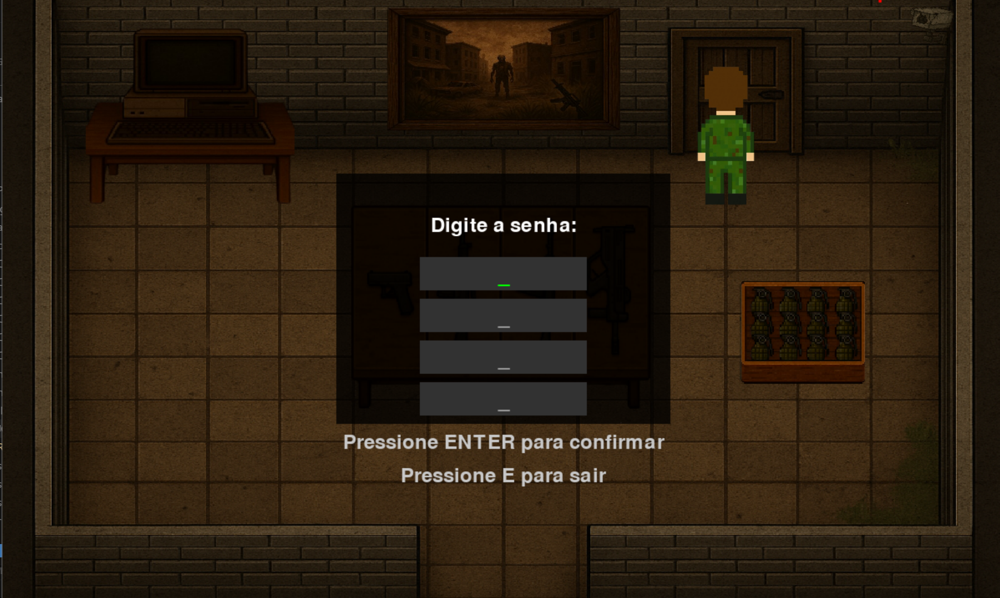
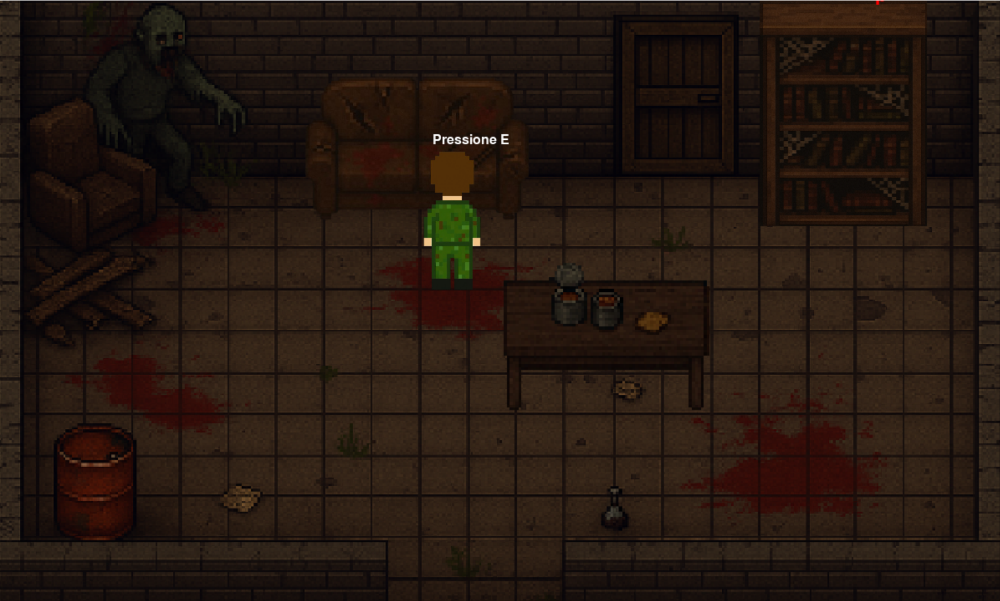
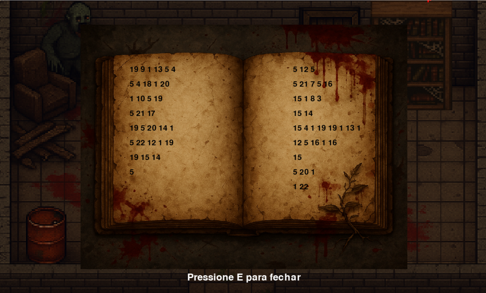

## 👥 Desenvolvedores

- Gabriel Holzhacker
- Rodrigo Buniac
- Danny Schepselevitz

# Escape Z 🧟‍♂️

Um jogo de terror e sobrevivência desenvolvido em Python usando Pygame, onde você é um professor do INSPER que precisa escapar de seus alunos zumbificados!

##  Pré-requisitos

- Python 3.10+
- Biblioteca Pygame instalada

## Como Executar

1. Certifique-se de ter Python e Pygame instalados
2. Clone este repositório
3. Execute o arquivo "JOGO.py"

##  História

INSPER - P3 - 2025. Um erro fatal foi cometido... Classes nas Provas Finais de DesSoft! Seus alunos, em fúria, viraram zumbis programadores. Você está preso no P3, cercado por zumbis de direito. Você tem 15 minutos para desvendar os mistérios e escapar.

## Como Jogar

1. **Controles:**
   - Movimento: Setas do teclado ou WASD
   - Interagir: Tecla E
   - Sair do jogo: ESC ou Y

2. **Objetivo:**
   - Encontrar pistas e resolver enigmas para escapar das salas
   - Evitar os zumbis
   - Completar o jogo antes que o tempo acabe (15 minutos). 

3. **Mecânicas:**
   - Explore as salas procurando por pistas
   - Interaja com objetos usando a tecla E
   - Resolva enigmas para desbloquear portas

## Sistema de Pontuação

- O jogo registra os melhores tempos
- Tente completar o jogo o mais rápido possível
- Seus recordes são salvos e exibidos na tela de vitória

## Recursos

- Efeitos sonoros 
- Música ambiente
- Animações 

## Imagens do jogo

### Tela Inicial

*Tela inicial do jogo com os botões de início e saída*

### Primeira Sala

*Primeira sala do jogo com os objetos interativos*

### Segunda Sala

*Segunda sala do jogo com as armas e pistas*

### Sistema de Portas

*Interface do sistema de senhas nas portas*

### Interação com Pistas

*Como interagir com as pistas do jogo*

### Exemplo de Pista

*Exemplo de uma pista

#Vídeo